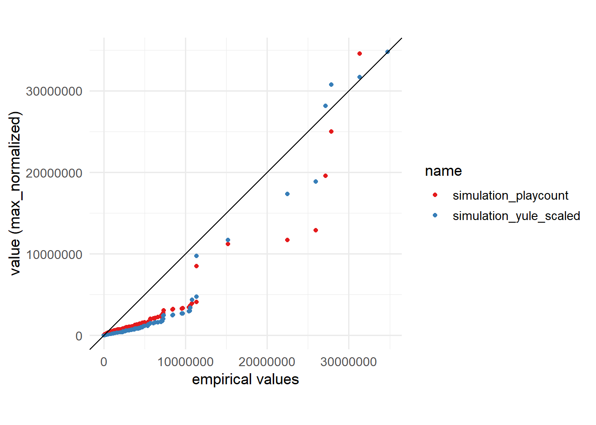

Libraries, options


```r
library(gamlss.dist)
library(tidyverse)
library(igraph)
library(fitdistrplus)
library(broom)
options(scipen = 999)
# install.packages("kSamples")
knitr::opts_chunk$set(echo = TRUE, warning = FALSE, message = FALSE)
```

Load data, scale


```r
load("data/simulation_results.Rdata")

similar_graph <- results_list[[1]]
normalize_by <- max

playcount <- vertex_attr(similar_graph)$playcount
simulation_playcount <- vertex_attr(similar_graph)$simulation_playcount
simulation_playcount_scaled <- simulation_playcount/normalize_by(simulation_playcount)*normalize_by(playcount)
```

Fit yule dist


```r
mle_yule <-
  fitdistrplus::mledist(vertex_attr(similar_graph)$playcount,
                        "YULE",
                        start = list("mu" = 1000))
mle_yule$estimate # 1898.966 - słabo pasuje
```

```
##       mu 
## 1898.966
```

simulate Yule (long)


```r
set.seed(10)
simulation_yule <-
  rYULE(9998, mu = mle_yule$estimate)
simulation_yule_scaled <- simulation_yule/normalize_by(simulation_yule)*normalize_by(playcount)
```

Quantile-quantile plot


```r
probs <- seq(0, 0.99, 0.01)
quantiles_simulation <- quantile(simulation_playcount, probs = probs)
quantiles_simulation <- as.numeric(quantiles_simulation)
quantiles_empirical <- quantile(playcount, probs = probs)
quantiles_yule <- qYULE(probs, mu = mle_yule$estimate)
# quantiles_yule <- quantiles_yule/max(quantiles_yule)*max(playcount)


tibble(
  p = 1:100,
  quantiles_empirical,
       quantiles_simulation, 
       quantiles_yule
       ) %>%
  mutate(quantiles_yule = quantiles_yule/normalize_by(quantiles_yule)*normalize_by(quantiles_empirical),
         quantiles_simulation = quantiles_simulation/normalize_by(quantiles_simulation)*normalize_by(quantiles_empirical)) %>%
  rename(`Simulation` = quantiles_simulation,
         `Fitted Yule distribution` = quantiles_yule) %>%
  pivot_longer(3:4) -> quantiles_long

ggplot(quantiles_long, aes(x = quantiles_empirical, y = value, color = name)) +
         geom_point() +
         coord_fixed() +
         theme(aspect.ratio = 1) +
  geom_abline(slope = 1) +
  labs(x = "empirical quantiles",
       y = "value (max-normalised)") +
  theme_minimal(base_size = 13) +
  scale_color_brewer(palette = "Set1")
```


Pair plot 


```r
tibble(
  playcount = sort(playcount),
  simulation_playcount = sort(simulation_playcount_scaled),
  simulation_yule_scaled = sort(simulation_yule_scaled)
) %>%
  pivot_longer(2:3) -> df_sorted_long


ggplot(df_sorted_long, aes(x = playcount, y = value, color = name)) +
  geom_point() +
  coord_fixed() +
  theme(aspect.ratio = 1) +
  geom_abline(slope = 1) +
  labs(x = "empirical values",
       y = "value (max_normalized)") +
  theme_minimal(base_size = 13) +
  scale_color_brewer(palette = "Set1")
```



Histogram for empirical data
logarithmic scale


```r
tibble(playcount = log(vertex_attr(similar_graph)$playcount)) %>%# View()
  mutate(playcount = ifelse(is.infinite(playcount), 0, playcount)) %>%
ggplot(aes(x = playcount)) +
  geom_histogram(fill = "#377EB8") +
  labs(x = "log(playcount)") +
  theme_minimal(base_size = 13)
```


Summary of empirical data (table)


```r
tibble(playcount = vertex_attr(similar_graph)$playcount) %>% 
  summarise(`No. observations` = n(),
            `min.` = min(playcount),
            `25% quantile` = quantile(playcount, 0.25),
            mean = mean(playcount),
            `50% quantile` = quantile(playcount, 0.5),
            `75% quantile` = quantile(playcount, 0.75),
            max = max(playcount),
            sd = sd(playcount)) %>%
  pivot_longer(everything()) %>%
  kableExtra::kable()
```

<table>
 <thead>
  <tr>
   <th style="text-align:left;"> name </th>
   <th style="text-align:right;"> value </th>
  </tr>
 </thead>
<tbody>
  <tr>
   <td style="text-align:left;"> No. observations </td>
   <td style="text-align:right;"> 9998.00 </td>
  </tr>
  <tr>
   <td style="text-align:left;"> min. </td>
   <td style="text-align:right;"> 0.00 </td>
  </tr>
  <tr>
   <td style="text-align:left;"> 25% quantile </td>
   <td style="text-align:right;"> 52.00 </td>
  </tr>
  <tr>
   <td style="text-align:left;"> mean </td>
   <td style="text-align:right;"> 88865.64 </td>
  </tr>
  <tr>
   <td style="text-align:left;"> 50% quantile </td>
   <td style="text-align:right;"> 553.50 </td>
  </tr>
  <tr>
   <td style="text-align:left;"> 75% quantile </td>
   <td style="text-align:right;"> 4652.75 </td>
  </tr>
  <tr>
   <td style="text-align:left;"> max </td>
   <td style="text-align:right;"> 34745306.00 </td>
  </tr>
  <tr>
   <td style="text-align:left;"> sd </td>
   <td style="text-align:right;"> 873056.77 </td>
  </tr>
</tbody>
</table>

Stats tests computation
Simulation


```r
test_simulation_ks <- ks.test(playcount, simulation_playcount_scaled)
test_simulation_ad <- kSamples::ad.test(playcount, simulation_playcount_scaled)
```

Yule


```r
test_yule_ks <- ks.test(playcount, simulation_yule_scaled)
test_yule_ad <- kSamples::ad.test(playcount, simulation_yule_scaled)
```

K-S tidy


```r
test_simulation_ks %>%
  broom::tidy() %>%
  select(statistic, p.value) %>%
  mutate(type = "Compared to simulation",
         result = "reject",
         test_name = "K-S test") %>%
  select(
    test_name,
    type, 
    statistic,
    p.value,
    result
  ) -> test_simulation_ks_tidy

test_yule_ks %>%
  broom::tidy() %>%
  select(statistic, p.value) %>%
  mutate(type = "Compared to Yule distribution",
         result = "reject",
         test_name = "K-S test") %>%
  select(
    test_name,
    type, 
    statistic,
    p.value,
    result
  ) -> test_yule_ks_tidy

rbind(test_simulation_ks_tidy,
      test_yule_ks_tidy) %>%
  kableExtra::kable()
```

<table>
 <thead>
  <tr>
   <th style="text-align:left;"> test_name </th>
   <th style="text-align:left;"> type </th>
   <th style="text-align:right;"> statistic </th>
   <th style="text-align:right;"> p.value </th>
   <th style="text-align:left;"> result </th>
  </tr>
 </thead>
<tbody>
  <tr>
   <td style="text-align:left;"> K-S test </td>
   <td style="text-align:left;"> Compared to simulation </td>
   <td style="text-align:right;"> 0.3276655 </td>
   <td style="text-align:right;"> 0 </td>
   <td style="text-align:left;"> reject </td>
  </tr>
  <tr>
   <td style="text-align:left;"> K-S test </td>
   <td style="text-align:left;"> Compared to Yule distribution </td>
   <td style="text-align:right;"> 0.4196839 </td>
   <td style="text-align:right;"> 0 </td>
   <td style="text-align:left;"> reject </td>
  </tr>
</tbody>
</table>

A-D tidy


```r
enframe(test_simulation_ad$ad[1,] ) %>%
  pivot_wider(names_from = "name") %>%
  select(1, 3) %>%
  mutate(type = "Compared to simulation",
         result = "reject",
         test_name = "Anderson-Darling test") %>%
  rename(
    statistic = AD,
    p.value = ` asympt. P-value`
    
  ) %>%
  select(
    test_name,
    type, 
    statistic,
    p.value,
    result
  ) -> test_simulation_ad_tidy


enframe(test_yule_ad$ad[1,] ) %>%
  pivot_wider(names_from = "name") %>%
  select(1, 3) %>%
  mutate(type = "Compared to Yule distribution",
         result = "reject",
         test_name = "Anderson-Darling test") %>%
  rename(
    statistic = AD,
    p.value = ` asympt. P-value`
    
  ) %>%
  select(
    test_name,
    type, 
    statistic,
    p.value,
    result
  ) -> test_yule_ad_tidy

rbind(test_simulation_ad_tidy,
      test_yule_ad_tidy) %>%
  kableExtra::kable()
```

<table>
 <thead>
  <tr>
   <th style="text-align:left;"> test_name </th>
   <th style="text-align:left;"> type </th>
   <th style="text-align:right;"> statistic </th>
   <th style="text-align:right;"> p.value </th>
   <th style="text-align:left;"> result </th>
  </tr>
 </thead>
<tbody>
  <tr>
   <td style="text-align:left;"> Anderson-Darling test </td>
   <td style="text-align:left;"> Compared to simulation </td>
   <td style="text-align:right;"> 355.12 </td>
   <td style="text-align:right;"> 0 </td>
   <td style="text-align:left;"> reject </td>
  </tr>
  <tr>
   <td style="text-align:left;"> Anderson-Darling test </td>
   <td style="text-align:left;"> Compared to Yule distribution </td>
   <td style="text-align:right;"> 1580.40 </td>
   <td style="text-align:right;"> 0 </td>
   <td style="text-align:left;"> reject </td>
  </tr>
</tbody>
</table>

```r
#### gif of histograms from simulation

# Okazało się mało ciekawe
```


---
title: "09_plots.R"
author: "Kamil Matuszelański"
date: "2019-12-23"
---
